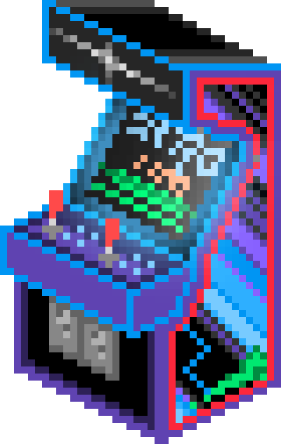

# Games React Native 

Es una Aplicación de un Ecommerce de Videojuegos, desarrollada con  **React Native**   y **Expo go**.

Está gestionada con **Redux**, que filtra por Categoría, puede agregar a Favorito y ve el historial de Orden de compra con su persistencia en **Firebase**. Tiene Autenticación de Usuario mediante Firebase, puede modificar su Perfil accediendo a la **Cámara** y con **SQLite** almacena los Datos del perfil.

 
    

             